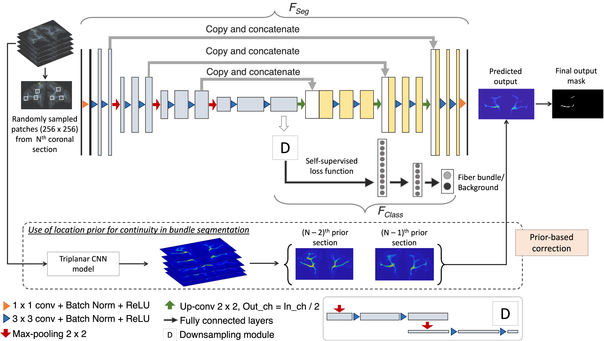
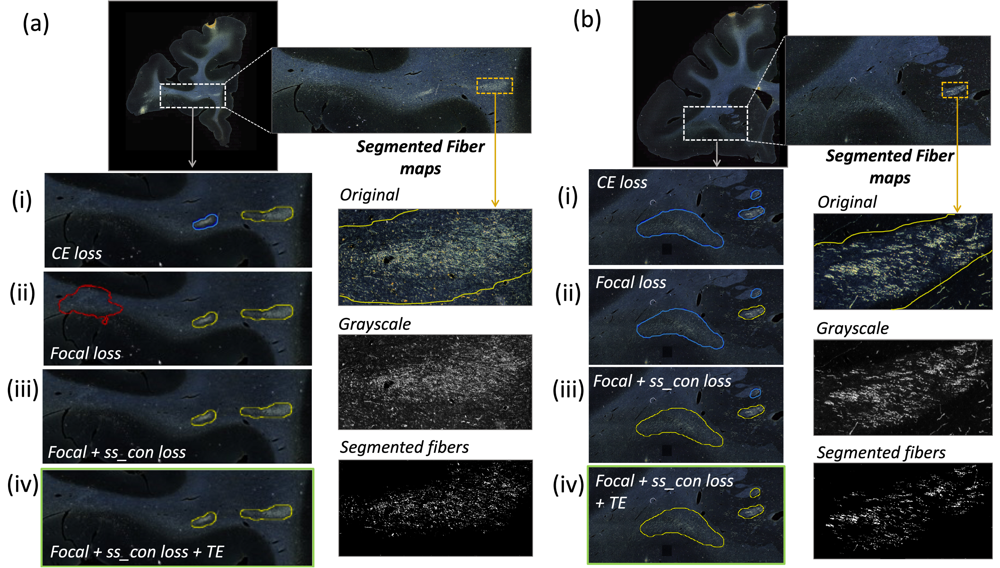

# Constrained self-supervised method with temporal ensembling for fiber bundle detection on anatomic tracing data

### Accepted to MICCAI 1st International Workshop on Medical Optical Imaging and Virtual Microscopy Image Analysis (MOVI 2022). Preprint DOI and citation details to be updated soon.

#### Software versions used:
- Python > 3.6
- PyTorch=1.5.0

#### Network architecture:

#### Fiber bundle segmentation results:

